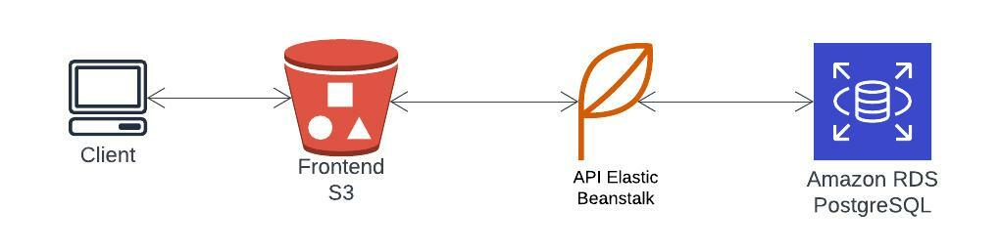

# AWS infrastrucure

- AWS S3 for hosting frontend
- AWS RDS postgres for database
- AWS Elastic Beanstalk for api deployment
- CircleCI for continuous integration and deployment

## Architecture diagram

## Description

- The cliens send request to the frontend which is hosted on S3
- The frontend send request to the api which is hosted on Elastic Beanstalk
- The api send request to the database which is hosted on RDS
- the responses are sent back to the client.