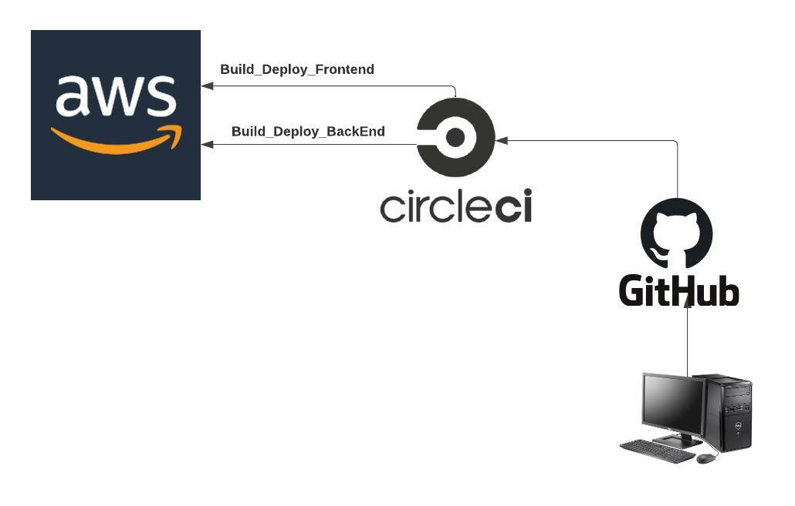
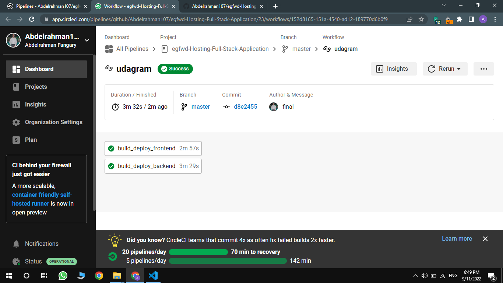

## Circleci Pipeline

- The pipeline consists of 2 jobs:
    - build_deploy_frontend
    - build_deploy_backend

- Both jobs are triggered when a commit is pushed to the master branch.
- The jobs are run in parallel.    

